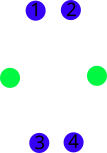
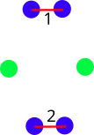

# Common Neighbour Analysis

The common neighbour analysis is a signature attributed to all pairs of nearest neighbour atoms in the system used to classify the geometrical environment of the atoms. For each pair of neighbours we evaluate a triplet of integers: (r, s, t) as:

=== "r"

    Number of shared neighbours of the pair
    { align=left }

=== "s"

    Number of bonds between the r nieghbours (excluding pair)
    { align=left }

=== "t"

    Longest path along connected bonds between the r neighbours (excluding pair)
    { align=left }