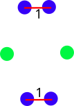

# Common Neighbour Analysis

The common neighbour analysis is a signature attributed to all pairs of nearest neighbour atoms in the system used to classify the geometrical environment of the atoms. For each pair of neighbours we evaluate a triplet of integers: (r, s, t) as:

=== "r"

    Number of shared neighbours of the pair, here the two green atoms share 4 neighbours (coloured in blue) so in this example the pair will have **r = 4**
    { align=left }

=== "s"

    Number of bonds between the r nieghbours (excluding pair), here you can see that there are two bonds between the 4 neighbours of the pair taken into consideration, so **s = 1**
    { align=left }

=== "t"

    Longest path along connected bonds between the r neighbours (excluding pair), here you can see that the two neighbours only form a path of length 1, so **t = 1**
    { align=left }


## Computing the pair CNA Signature

As said, the CNA signature is a pair property, in pySNOW we can compute the CNA for each pair of atom and obtain it as an $3\cdot N_{pairs}$ array where for each pair the subarray contains the (r, s, t) values, optionally the function will also return a list containing the indeces of the atoms forming each pair for which the CNA signature has been computed, this can be used (and is used by other fnctions which we will present below) to identify patterns in the observed CNA signatures.

The method to co,pute the CNA involves, as always, as a first step, the reading of the coordinates of the atoms:

=== "Using pySNOW io"

    ```py linenums="1"
    from snow.lodispp.pp_io import read_xyz
    from snow.lodispp.cna import calculate_cna

    el, coords = read_xyz("Au976To.xyz")
    cut_off = 4.079 * 0.85 # (1)
    n_pairs, cnas, pairs = calculate_cna(1, coords, cut_off, return_pair = True) # (2)
    ```

    1. Cutoff as 0.85*lattice parameter
    2. The first 1 is the index_frame placeholder. Setting *return_pair* to **True** will return the indeces of the atoms forming each pair

=== "Using ASE io"

    ```py linenums="1"
    from ase.io import read
    from snow.lodispp.cna import calculate_cna

    nano = read("Au976To.xyz")

    coords = nano.get_positions()

    cut_off = 4.079 * 0.85 # (1)
    n_pairs, cnas, pairs = calculate_cna(1, coords, cut_off, return_pair = True) # (2)
    ```

    1. Cutoff as 0.85*lattice parameter
    2. The first 1 is the index_frame placeholder. Setting *return_pair* to **True** will return the indeces of the atoms forming each pair

=== "Using Ovito io"